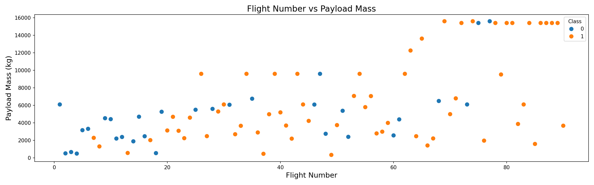
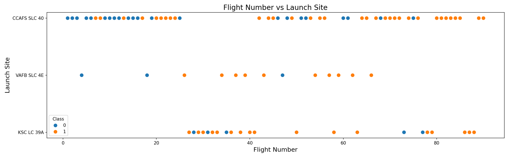
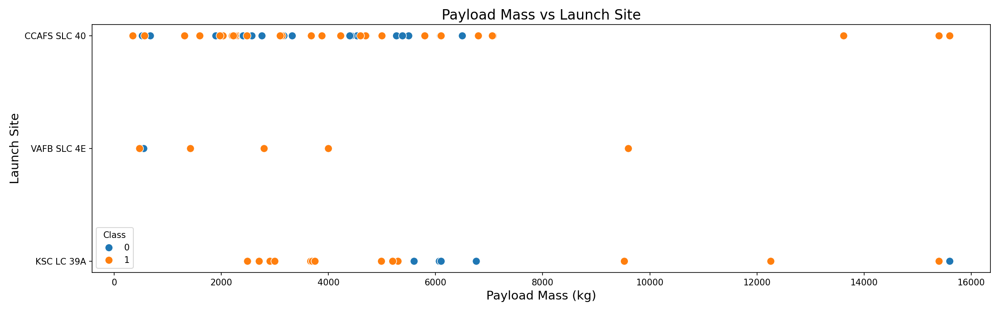
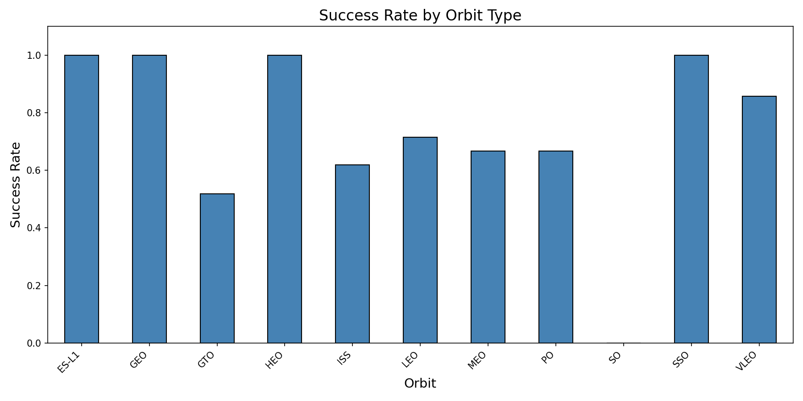
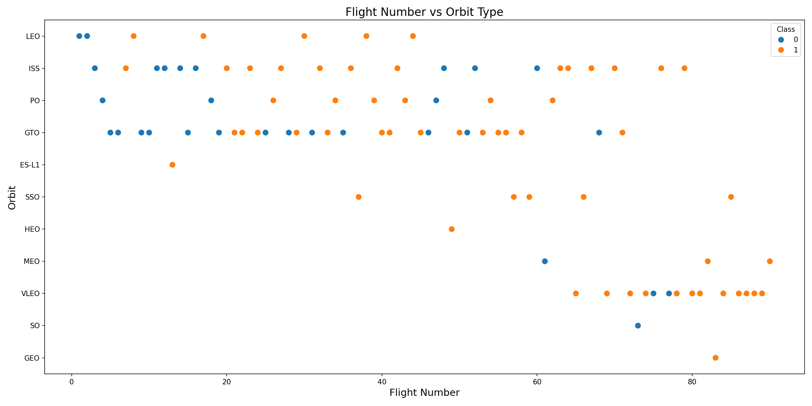
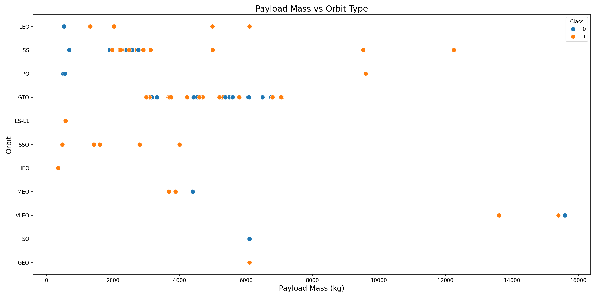
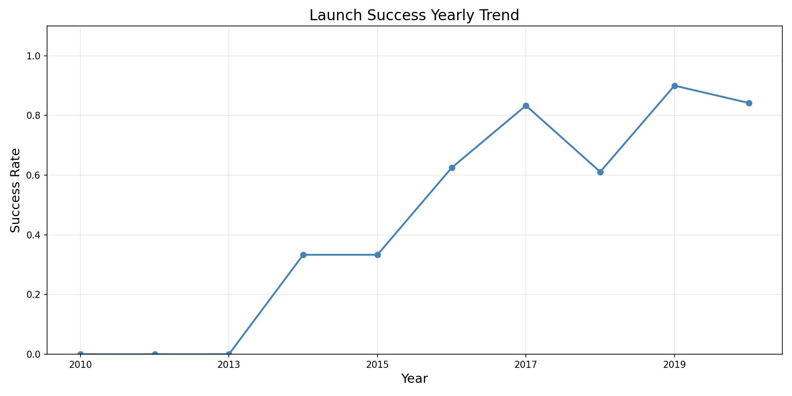

# Phase 4: EDA Visualization — Findings

## Overview
Performed exploratory data analysis using Matplotlib and Seaborn, then applied feature engineering (OneHotEncoding) to prepare data for ML.

## Visualizations

### Flight Number vs Payload Mass

As flight numbers increase, successful landings (Class=1) become more frequent. Higher payload masses also correlate with later, more successful flights.

### Task 1: Flight Number vs Launch Site

KSC LC-39A shows a higher proportion of successful landings, especially in later flights. CCAFS SLC-40 has more early failures.

### Task 2: Payload Mass vs Launch Site

VAFB SLC-4E only handles payloads under ~10,000 kg. KSC LC-39A handles the heaviest payloads. Heavy payload launches from KSC LC-39A tend to succeed.

### Task 3: Success Rate by Orbit

ES-L1, GEO, HEO, and SSO orbits show 100% success. GTO has the lowest success rate among frequently-used orbits. ISS and VLEO show moderate-to-high success.

### Task 4: Flight Number vs Orbit

LEO orbit shows strong correlation between flight number and success. GTO shows mixed results regardless of flight number.

### Task 5: Payload Mass vs Orbit

Heavy payloads for Polar, LEO, and ISS orbits have high success rates. GTO payloads show mixed results across all payload masses.

### Task 6: Yearly Success Trend

Clear upward trend from 2013 onward. Success rate reached near-100% by 2019-2020, reflecting SpaceX's maturation of landing technology.

## Feature Engineering

### Task 7: OneHotEncoding
Applied `pd.get_dummies()` to categorical columns: Orbit, LaunchSite, LandingPad, Serial.

### Task 8: Cast to float64
All features converted to float64 for ML compatibility.

**Final feature matrix**: 90 rows × 80 columns

## Output
- 7 PNG visualizations saved to `docs/`
- `dataset_part_3.csv` — feature-engineered dataset ready for ML
