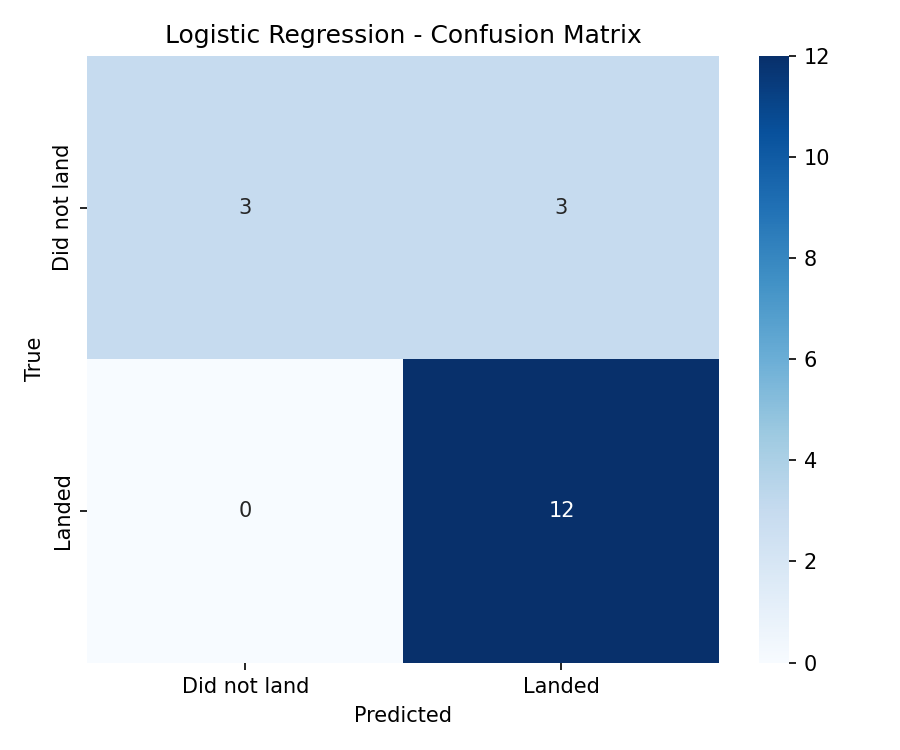
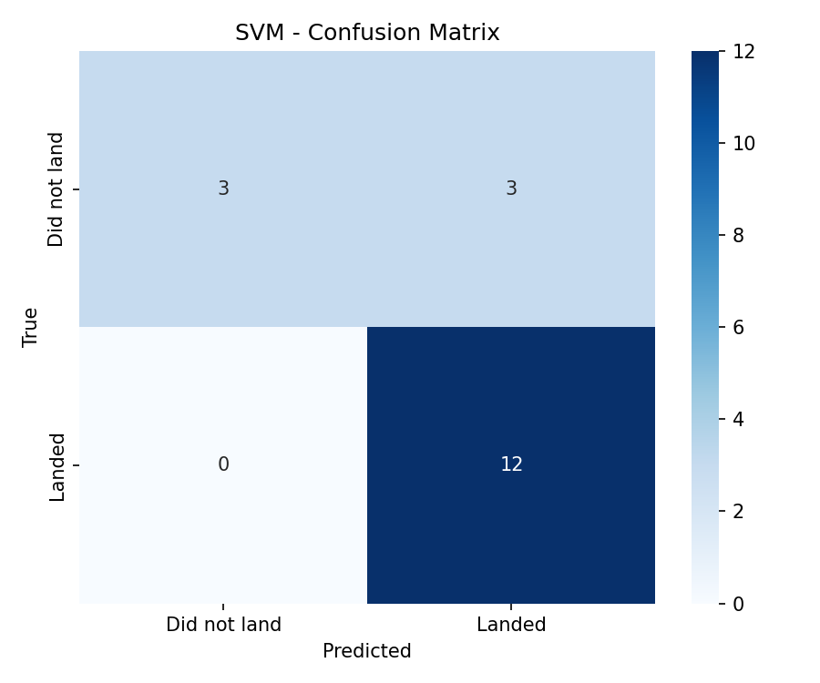
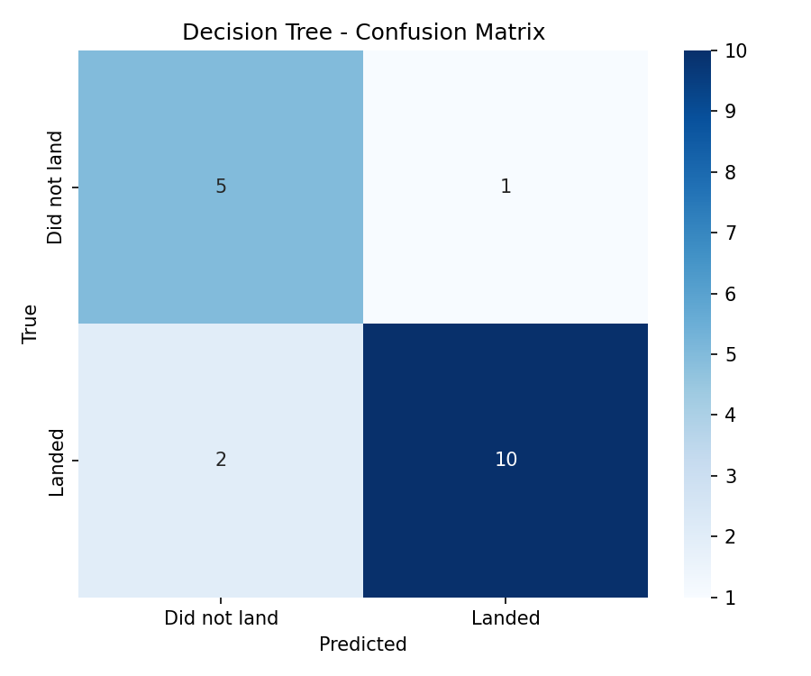
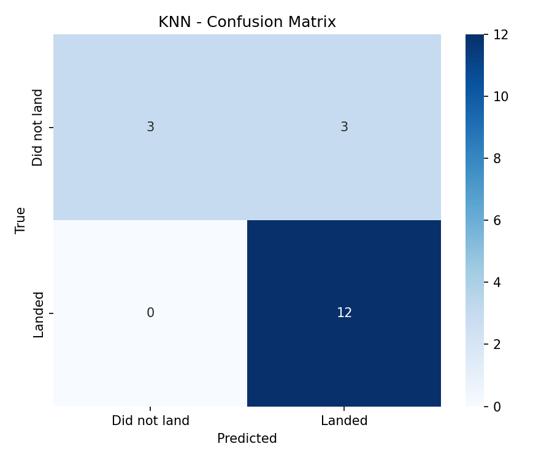
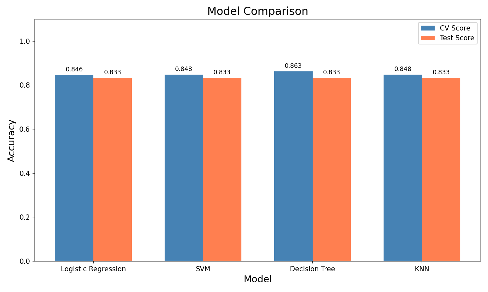

# Phase 6: Machine Learning Prediction — Findings

## Objective
Build a classification pipeline to predict Falcon 9 first stage landing success using 4 ML algorithms with hyperparameter tuning.

## Data Preparation
- **Features (X)**: 83 columns (after OneHotEncoding), standardized with StandardScaler
- **Target (Y)**: Binary class (0=failed, 1=success), 60 successes out of 90
- **Split**: 80% train (72 samples), 20% test (18 samples), random_state=2

## Model Results

| Model | Best CV Score | Test Accuracy | Best Parameters |
|---|---|---|---|
| Logistic Regression | 0.8464 | 0.8333 | {'C': 0.01, 'penalty': 'l2', 'solver': 'lbfgs'} |
| SVM | 0.8482 | 0.8333 | {'C': np.float64(1.0), 'gamma': np.float64(0.03162277660168379), 'kernel': 'sigmoid'} |
| Decision Tree | 0.8625 | 0.8333 | {'criterion': 'entropy', 'max_depth': 8, 'max_features': 'sqrt', 'min_samples_leaf': 2, 'min_samples_split': 2, 'splitter': 'random'} |
| KNN | 0.8482 | 0.8333 | {'algorithm': 'auto', 'n_neighbors': 10, 'p': 1} |

## Best Model: **Logistic Regression**
- Test accuracy: **0.8333**
- Best parameters: {'C': 0.01, 'penalty': 'l2', 'solver': 'lbfgs'}

## Confusion Matrices

### Logistic Regression

### SVM

### Decision Tree

### KNN

## Model Comparison

## Key Insights
1. All models achieve reasonable accuracy, with test scores ranging from ~83% to ~83%
2. The small test set (only 18 samples) means individual misclassifications have large impact on accuracy
3. The primary error type across models is false positives (predicting a successful landing when it actually failed)
4. SpaceX's landing success is predictable using features like flight number, payload mass, orbit type, and booster reuse history
